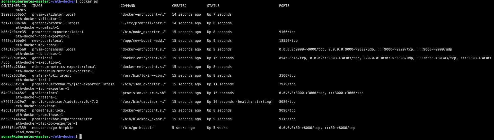
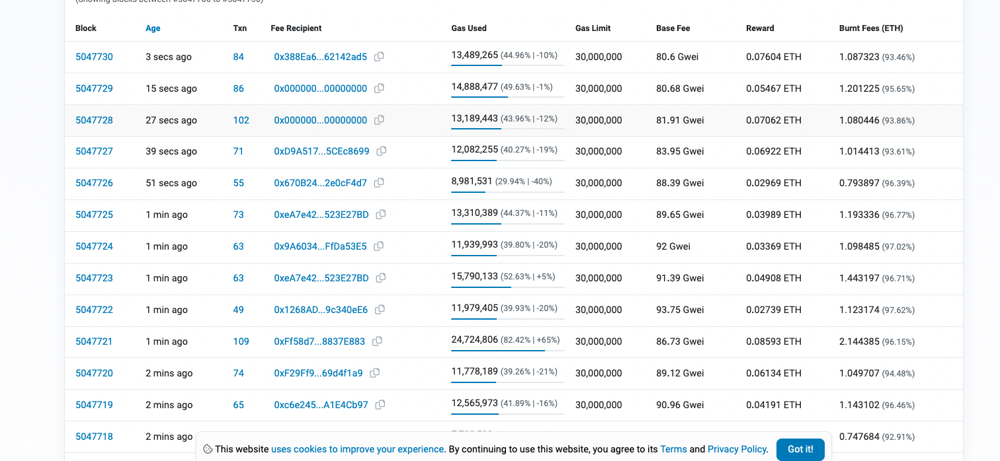

## Run a Sepolia node on Bare-Metal linux using docker
# Install Docker & git
```sh
# install git
sudo apt update # update
sudo apt install git # git install 
# install docker --> DOCS: https://www.digitalocean.com/community/tutorials/how-to-install-and-use-docker-on-ubuntu-20-04
```
### 1. Clone eth-docker
USED Documentation https://taiko.xyz/docs/guides/run-a-sepolia-node
```sh
git clone https://github.com/eth-educators/eth-docker # cloning ethereum DOCKER
cd eth-docker 
```
### 2. Enable archive node
```sh
cp default.env .env # 
vi .env `ARCHIVE_NODE=true` # I didn't do it. Cuz it says that "  use a lot of disk - in the case of Geth >12TB "
```
### 3. Expose RPC ports
To expose the node's RPC ports (for a Taiko L2 node to make calls to it), you can append el-shared.yml to the list of files in the COMPOSE_FILE variable in your .env file:
```sh
vi .env `COMPOSE_FILE=lighthouse-cl-only.yml:geth.yml:el-shared.yml` # RPC PORT
```
### 4. Quickstart
USED Documentation https://eth-docker.net/Usage/QuickStart/
```sh
<!--Sepolia Testnet (permissioned validators)-->                    # what I select from promt wizard
<!--Ethereum node - consensus, execution and validator client-->    # what I select from promt wizard
<!--Prysm (Go) - consensus and validator client-->                  # what I select from promt wizard
<!--Geth (Go)-->                                                    # what I select from promt wizard
<!--https://sepolia.beaconstate.info-->                             # what I select from promt wizard
<!--336a49feac6d9a5edb779be53a@boost-relay-sepolia.flashbots.net--> # what I select from promt wizard
and last ETH addess # Transaction rewards goes to MY ETH address         

```
### 5. Checking
```sh
docker ps
```

### syncing
```sh
docker logs -f 563
```

 

### Grafana & Prometheus


# issues
1. issue: Storage --> warning
2. Permission issue /Docker user, Docker volume (failed to solve: failed to read dockerfile: failed to mount /var/lib/docker/tmp/buildkit-mount3449136959: [{Type:bind Source:/var/lib/docker/overlay2/cr7xzajuvxkq2u001621vds1b/diff Options:[rbind ro]}]: permission denied) --> fixed it using google
3. actually first few mins I have no idea what I am doing XD